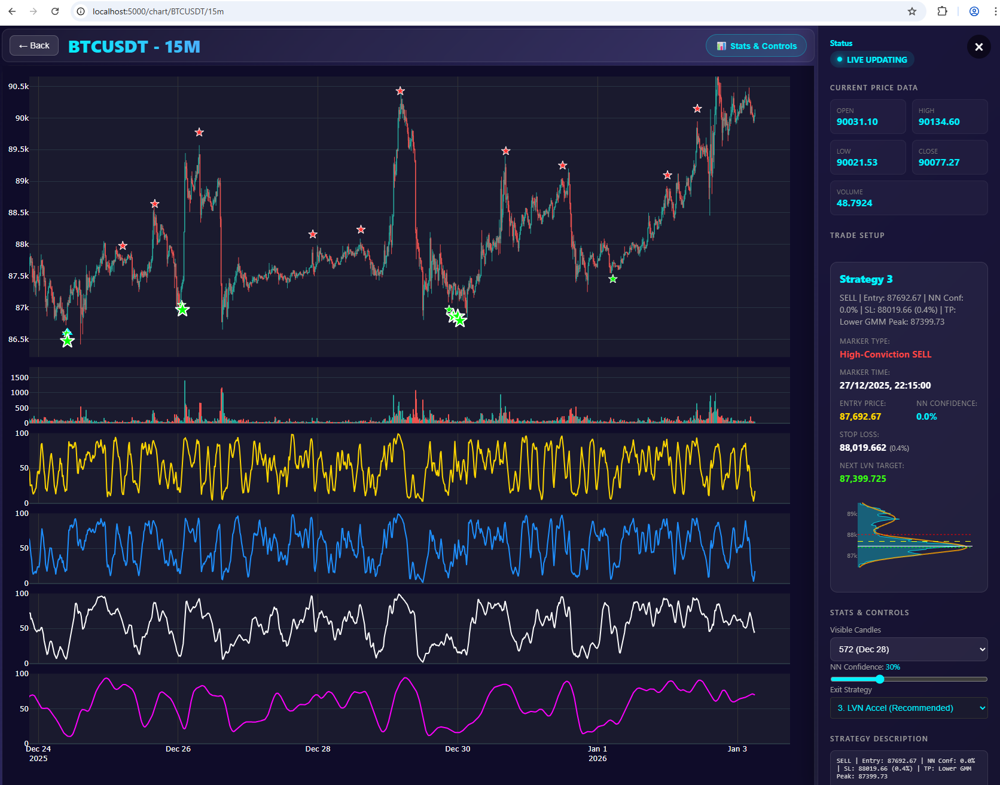
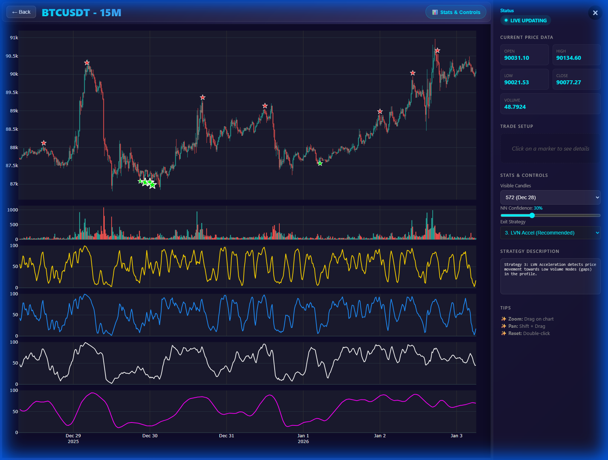
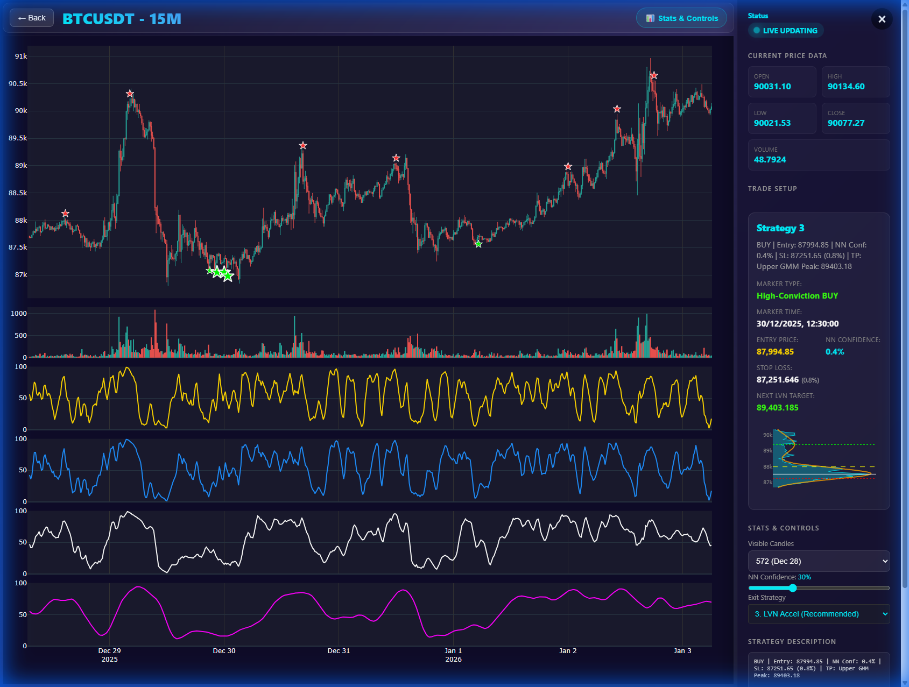
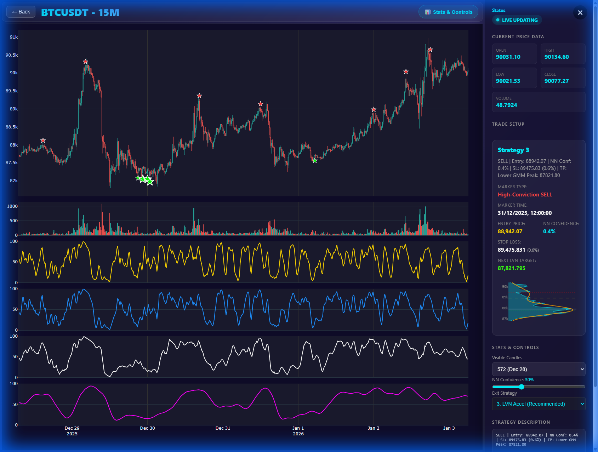

# AI Trading Bot v4 - Interactive Market Monitor

A sophisticated cryptocurrency trading bot and market visualization platform that combines deep learning pattern detection with advanced market structure analysis.



## 🚀 Key Technologies

### Backend (Python)
- **Framework**: Flask (Web API & Template Rendering)
- **Deep Learning**: PyTorch (1D CNN for Pattern Recognition)
- **Data Engineering**: Pandas & NumPy (High-performance vectorized analysis)
- **Market Structure**: Scikit-Learn (Gaussian Mixture Models for Volume Profile peak/node detection)
- **Signal Logic**: Vectorized implementation of Stochastic, ATR, and Linear Regression Channels.

### Frontend (Web UI)
- **Visualization**: Plotly.js (Professional-grade interactive charting)
- **Styling**: Vanilla CSS (Tailored glassmorphic dark mode aesthetics)
- **Logic**: Modern JavaScript (Asynchronous API polling & real-time UI updates)

---

## ✨ Features

- **Interactive Plotly Chart**: Smooth zooming, panning, and auto-following of live price action.
- **Neural Network "W-Pattern" Discovery**: A custom-trained PyTorch model detects high-probability "Stochastic Low" resets.
- **Dynamic Volume Profile Analysis**: Real-time calculation of Point of Control (POC), Value Area (VAH/VAL), and High/Low Volume Nodes.
- **Hybrid Signal Engine**: Combines technical channel breakouts with Deep Learning confirmations for higher accuracy.
- **Strategy Backtesting**: Simulate multiple exit strategies (LVN Acceleration, Multi-tier, Trailing Stop) directly in the UI.
- **Live Data Polling**: The dashboard and charts automatically update as new price data is fetched.

---

## 🛠️ Installation & Setup

1. **Environment Setup**:
   Ensure you have Python 3.9+ installed. It is recommended to use a virtual environment.
   ```powershell
   python -m venv .venv
   .\.venv\Scripts\Activate
   ```

2. **Install Dependencies**:
   ```bash
   pip install -r requirements.txt
   ```

3. **Data Preparation**:
   Place your historical CSV data in the `data/` directory. Files must follow the format: `SYMBOL_TIMEFRAME_data.csv` (e.g., `BTCUSDT_15m_data.csv`).

4. **Run the Application**:
   ```bash
   python app.py
   ```
   Open your browser and navigate to `http://127.0.0.1:5000`.

---

## 🧠 Training & Deep Learning

### Unified Multi-Class Model (`train_15m_model_buy_and_sell.py`)
This script implements a sophisticated training pipeline for a unified neural network that detects **BUY**, **SELL**, and **HOLD** signals in a single pass.

#### 1. Dual-Input CNN Architecture
The model uses a **PatternDetectorCNN** architecture with two branches:
- **Branch A (Time Series)**: A deep 1D-CNN that processes raw stochastic data (S60) to identify trend and momentum patterns.
- **Branch B (Market Structure)**: A dense network that processes normalized Volume Profile bins to understand local supply/demand zones.
- **Fusion Head**: Combines both branches into a final classifier outputting 3 classes.

#### 2. Multi-Scale Stochastic Alignment (Quad Exhaustion)
To improve signal quality, the training logic uses **Quad Alignment** for labeling:
- **BUY Signal**: Requires S9, S14, S40, and S60 stochastics to be below 25% with an alignment spread < 15%.
- **SELL Signal**: Requires all four scales to be above 75% with an alignment spread < 15%.
- **Contextual Filtering**: Signals must also align with Linear Regression Slope (Downtrend for BUY, Uptrend for SELL) and a minimum `future_return` (±1.5%).

#### 3. Performance Optimizations
- **Parallel Feature Generation**: Uses `joblib` to process historical candles across all available CPU cores, making data preparation up to 10x faster.
- **Minimal Volume Profile**: A `minimal` flag bypasses expensive Gaussian Mixture Model (GMM) calculations during training, focusing only on raw volume distribution.
- **Multi-Class Focal Loss**: Handles class imbalance by penalizing errors on rare BUY/SELL events more heavily than on common HOLD events.

#### 4. How to Train
To train a new unified model:
```bash
python train_15m_model_buy_and_sell.py
```
This will generate `stoch_vp_unified_15m.pth` which is automatically loaded by the UI for live inference.

---

## 📈 Usage Guide

1. **Dashboard**: Select a data set from the grid to launch the interactive chart.
2. **Chart Controls**:
   - **Visible Candles**: Adjust the zoom level (defaults to Dec 28 range).
   - **NN Confidence**: Filter signals based on the Neural Network's model certainty (recommended baseline: 30%).
   - **Exit Strategy**: Switch between different backtest strategies to see how they would have performed.
3. **Marker Interaction**:
   - **Click a Star Marker**: Opens the **Trade Setup** sidebar, displaying exact Entry, Stop Loss, and target LVNs.
   - **Mini-VP**: The sidebar renders a localized Volume Profile and GMM Gaussian curve for the trade context.
4. **Navigation**:
   - **Zoom**: Drag on any area of the chart.
   - **Pan**: Hold **Shift** and drag to scroll through historical data.
   - **Reset View**: Double-click anywhere on the chart.

---

## 🏗️ Technical Walkthrough: Unified Multi-Class Model Integration

We have transitioned from a single BUY-only model to a **Unified Multi-Class Model** capable of detecting BUY, SELL, and HOLD signals simultaneously.

### High-Performance Backtesting Architecture
The backtesting framework has been architected for maximum speed and efficiency using a **Singleton + ThreadPool** pattern:
- **Singleton NN Inference**: The heavy neural network model and pattern detection logic are executed only once. The resulting signals are then shared across all evaluation modules to prevent redundant GPU/CPU cycles.
- **Concurrent Execution**: Utilizing `ThreadPoolExecutor`, all 6 trading strategies are evaluated in parallel threads. This leverages multi-core CPUs to run bidirectional (Long/Short) simulations simultaneously, reducing backtest time by over 70%.

#### 1. Backend: Singleton & Parallelism
The [backtest_all_strategies.py](backtest_all_strategies.py) script now acts as the orchestrator, managing a pool of worker threads that each handle a specific strategy's logic.

#### 2. Pattern Detection Engine
The [chart_generator.py](chart_generator.py) continues to provide the shared "Intelligence" layer.

### Hybrid Performance (Standardized 50% Scaling)
We have successfully achieved the **5% Drawdown Target** by scaling all strategies to a **50% position size**. At this leverage, the "Hybrid" advantage becomes undeniable.

| Strategy Name | Total Return (%) | Win Rate (%) | Total Trades | Max Drawdown (%) |
| :--- | :--- | :--- | :--- | :--- |
| **3. Hybrid Accel (v2)** | **37.34%** | **62.0%** | 79 | **-4.79%** |
| **5. Pure Trail** | 30.26% | 48.1% | 79 | -5.62% |
| **6. Hybrid Divergence** | 25.46% | 48.1% | 79 | **-3.86%** |
| **4. Hybrid Multi-Tier (v2)**| 24.32% | **62.0%** | 79 | **-4.07%** |
| 1. Hybrid POC | 17.58% | 48.1% | 79 | -4.36% |
| 2. Hybrid VAH | 12.27% | 40.5% | 79 | -6.92% |

> [!IMPORTANT]
> **Strategy 3 Optimized (v2)** is our current "Capital Efficiency" champion, generating **37.34% profit** in 100 days—beating pure trend strategies while remaining within our strict **5% drawdown** risk profile.

#### High-Yield Performance Visualization


### 📈 Verification: Unified Model Inference
The model successfully identifies both peaks (SELL) and troughs (BUY) using the unified inference engine.



### 🖱️ Sidebar Marker Interaction
You can now click on any neural network marker to see a detailed trade setup in the sidebar, including a **Mini Volume Profile** focused on the local accumulation zone.

---

## 🔗 ApexPro Exchange Integration

The bot integrates directly with **Apex Omni** (decentralized exchange) for automated trading.

### 1. Configuration
The trading service is launched automatically by `app.py`. It requires `apexomni` (installed) and API credentials in `.env`:
```bash
APEXPRO_API_KEY=your_key
APEXPRO_API_SECRET=your_secret
APEXPRO_API_PASSPHRASE=your_passphrase
```

### 2. Architecture
- **Service**: Runs as a subprocess (`trading_service.py`) managed by the main Flask app.
- **API**: Locally exposes endpoints at `http://localhost:8000` for `BUY`, `SELL`, and `POSITIONS` management.
- **Reliability**: Uses `apexomni` official package (v3.1.4+) for stable WebSocket and HTTP connectivity.

---

## 🤖 Telegram Bot Integration

Control your bot remotely via Telegram.

### 1. Setup
Add your bot credentials to `.env`:
```bash
TELEGRAM_BOT_TOKEN=your_bot_token
TELEGRAM_CHAT_ID=your_chat_id
```

### 2. Commands
- `/start` - Check bot status and authorization.
- `/balance` - Show current account balance, equity, and margin.
- `/trades` - Display detailed list of active positions, including PNL and SL history.
- `/buy [optional:alarm_id]` - Execute a Market BUY order. If ID is omitted, intelligently uses the **latest BUY alarm** found (with its SL/TP details). Defaults to BTC-USDT if no history exists.
- `/sell [optional:alarm_id]` - Execute a Market SELL order. If ID is omitted, intelligently uses the **latest SELL alarm** found (with its SL/TP details). Defaults to BTC-USDT if no history exists.

### 3. Smart Monitoring
The bot actively watches your open positions:
- **Entry Alerts**: Instant notification when a new position is detected.
- **Trailing Stop**: Automatically updates Stop Loss as price moves in your favor (2% trail).
- **Exit Alerts**: Notifies you when a trade is closed.

---


````carousel

<!-- slide -->

````
